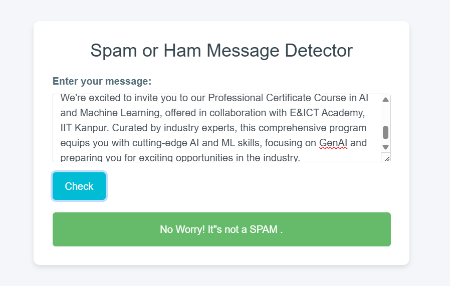
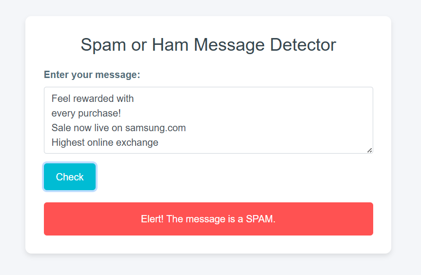

# 📧 SpamShield 


SpamShield is a user-friendly web-based application designed to classify messages as either SPAM or HAM (not SPAM). This project mainly focus on helping users to filter out unwanted and harmful messages from their inbox. SpamShield is built using Flask for the backend and HTML/CSS for the frontend and a Gaussian Naive Bayes machine learning algorithm used to train the model.

## 🧠 Model

* Algorithm: Gaussian Naive Bayes (GNB)
* Training: The model was trained on a labeled dataset of spam and non-spam messages.
* Accuracy: Achieved a validation accuracy of 89% during training.
* Input: Takes raw text messages as input.
* Output: Classifies the message as either "Spam" or "Ham".


## 🚀 Features

### User-Friendly Interface: 
The web app allows users to input a message through an interactive and responsive form, providing a seamless experience.
### Real-time Prediction: 
Users can instantly receive feedback on whether their input message is classified as Spam or Ham.
### Model Accuracy:
With an accuracy of 89%, the application offers a balance between speed and reliability, making it a practical tool for everyday use.


## 🛠️ Installation

- Clone the Repository using below command

```bash
  git clone https://github.com/zaranasavani/SpamShield.git
```
  
- Create and Activate Virtual environment

    Navigate into the project directory 
    ```bash
    python -m venv env
    .\env\Scripts\activate  

    ```

- install Dependencies

```bash
  pip install -r requirements.txt
```

- Run app.py file
```bash
  python app.py
```

- Open the application:

    follow link show in your terminal after runnig app.py
    e.g. http://127.0.0.1:5000


## Screenshots




